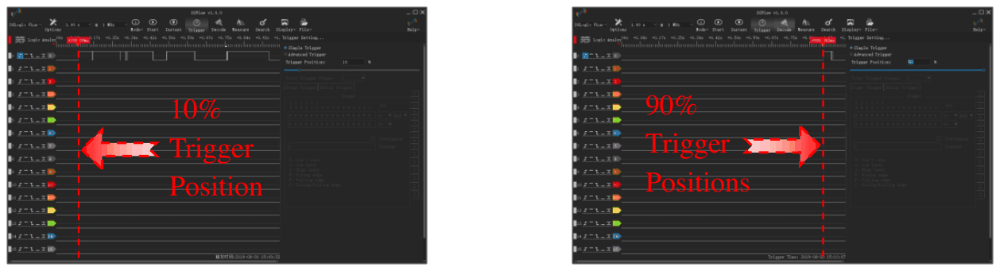
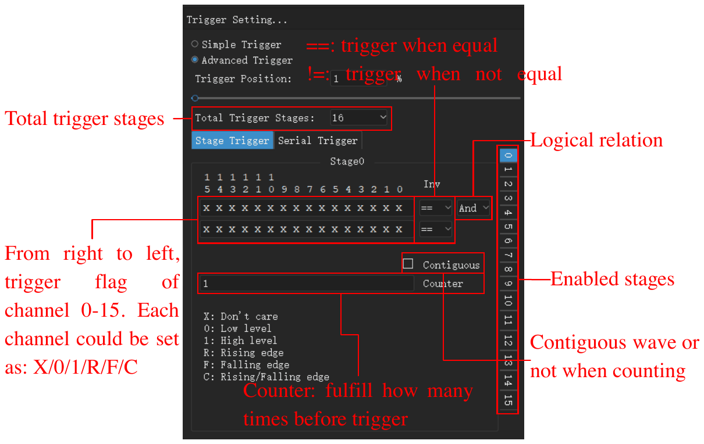
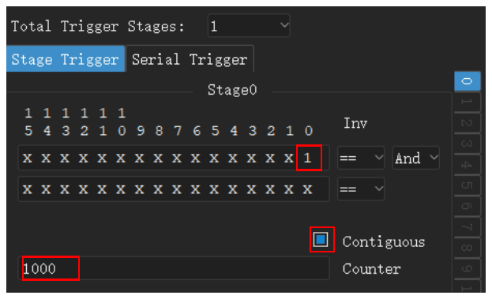
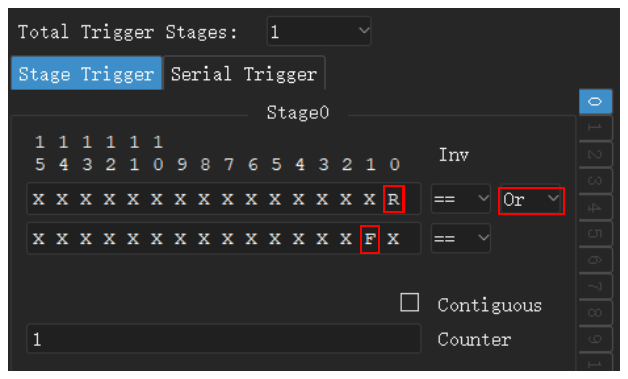
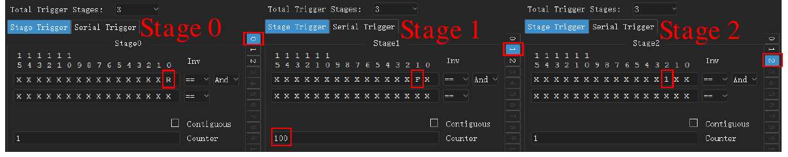
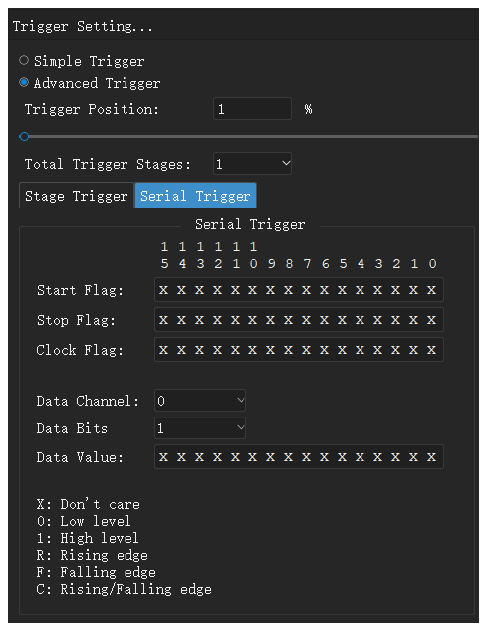
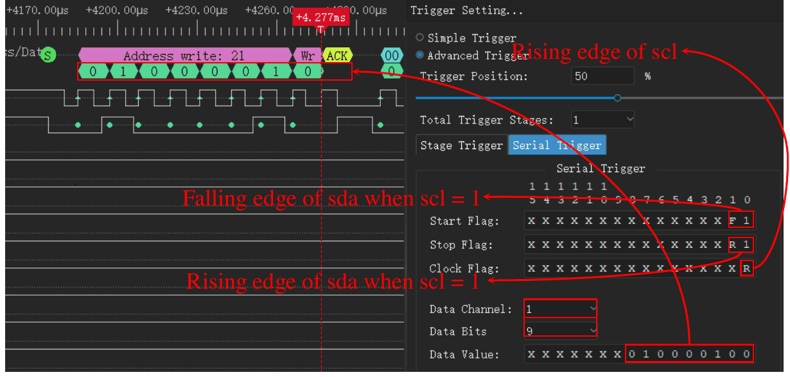
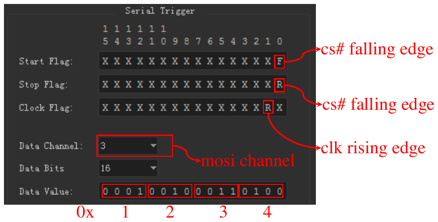

# Kích hoạt

Kích hoạt là một điều kiện trong tín hiệu. Khi điều kiện xảy ra, thiết bị đánh dấu thời điểm đó là điểm kích hoạt. Kích hoạt giúp bạn thu phần tín hiệu mà bạn muốn kiểm tra.

Ứng dụng có hai loại kích hoạt:

- **Kích hoạt đơn giản**: Một sườn hoặc một mức trên một hoặc nhiều kênh.
- **Kích hoạt nâng cao**: Một chuỗi điều kiện, hoặc một giá trị trên bus nối tiếp.

Để mở khung neo kích hoạt, nhấp **Kích hoạt** trên thanh công cụ hoặc nhấn `T`.

> [!NOTE]
> Nếu tín hiệu không khớp với điều kiện kích hoạt, lần thu tiếp tục chờ. Để xem tín hiệu mà không cần kích hoạt, nhấp **Tức thì**. Để dừng chờ, nhấp **Dừng**.

## Vị trí kích hoạt

Cài đặt **Vị trí kích hoạt** đặt vị trí của điểm kích hoạt trong lần thu. Giá trị là phần trăm của thời lượng lấy mẫu.

- Giá trị nhỏ, ví dụ 10%, hiển thị nhiều tín hiệu hơn sau kích hoạt.
- Giá trị lớn, ví dụ 90%, hiển thị nhiều tín hiệu hơn trước kích hoạt.

Vị trí kích hoạt dùng bộ nhớ của thiết bị. Vì vậy, bạn chỉ đặt được nó ở chế độ bộ đệm. Ở chế độ luồng, vị trí kích hoạt luôn khoảng 1%.

<!-- TODO: new screenshot -->

## Kích hoạt đơn giản

Mỗi nhãn kênh trong vùng dạng sóng có năm nút kích hoạt. Từ trái sang phải, các nút là:

1. Sườn lên
2. Mức cao
3. Sườn xuống
4. Mức thấp
5. Sườn lên hoặc sườn xuống

Để đặt kích hoạt đơn giản, làm các bước sau:

1. Mở khung neo kích hoạt.
2. Chọn **Kích hoạt đơn giản**.
3. Trên nhãn của một kênh, nhấp nút kích hoạt bạn muốn. Nút đổi sang màu khác.
4. Để bỏ kích hoạt khỏi một kênh, nhấp lại cùng nút đó.
5. Đặt **Vị trí kích hoạt**.

Nếu bạn đặt kích hoạt trên nhiều kênh, tất cả điều kiện phải xảy ra tại cùng một mẫu (AND logic).

## Kích hoạt nâng cao

> [!NOTE]
> Kích hoạt nâng cao chỉ có ở chế độ bộ đệm. Để dùng nó, đặt **Chế độ hoạt động** thành **Chế độ bộ đệm**. Xem [Tùy chọn thiết bị](05-device-options.md).

Để dùng kích hoạt nâng cao, chọn **Kích hoạt nâng cao** trong khung neo kích hoạt. Sau đó chọn thẻ **Kích hoạt nhiều tầng** hoặc thẻ **Kích hoạt nối tiếp**.

### Giá trị cho mỗi kênh

Kích hoạt nhiều tầng và kích hoạt nối tiếp dùng một hàng 16 ký tự. Mỗi ký tự là điều kiện cho một kênh. Ký tự bên phải là kênh 0. Ký tự bên trái là kênh 15.

| Ký tự | Điều kiện |
| --- | --- |
| `X` | Mọi giá trị (kênh không có ảnh hưởng). |
| `0` | Mức thấp. |
| `1` | Mức cao. |
| `R` | Sườn lên. |
| `F` | Sườn xuống. |
| `C` | Sườn lên hoặc sườn xuống. |

### Kích hoạt nhiều tầng

Kích hoạt nhiều tầng là một chuỗi điều kiện. Mỗi điều kiện là một tầng. Thiết bị kiểm tra tầng 0 trước. Khi điều kiện của một tầng xảy ra, thiết bị chuyển sang tầng tiếp theo. Kích hoạt xảy ra khi tầng cuối cùng hoàn tất. Bạn có thể dùng tối đa 16 tầng.

Mỗi tầng có các cài đặt sau:

- Hai hàng điều kiện kênh.
- Với mỗi hàng, `==` hoặc `!=`. Với `==`, điều kiện xảy ra khi các kênh khớp với hàng. Với `!=`, điều kiện xảy ra khi các kênh không khớp với hàng.
- **Và** hoặc **Hoặc**. Cài đặt này kết nối hai hàng.
- **Bộ đếm**: Số lần điều kiện phải xảy ra trước khi tầng hoàn tất.
- **Liên tiếp**: Khi bạn chọn ô đánh dấu này, điều kiện phải xảy ra ở các mẫu liền nhau, không ngắt quãng.

<!-- TODO: new screenshot -->

Để đặt kích hoạt nhiều tầng, làm các bước sau:

1. Trong **Tổng số tầng kích hoạt**, chọn số tầng.
2. Trong danh sách tầng bên phải, nhấp tầng 0.
3. Nhập điều kiện kênh vào hàng thứ nhất.
4. Nếu cần, nhập điều kiện kênh vào hàng thứ hai và chọn **Và** hoặc **Hoặc**.
5. Nhập giá trị vào **Bộ đếm**.
6. Làm lại các bước 2 đến 5 cho mỗi tầng khác.

Đây là ba ví dụ.

**Ví dụ 1.** Kích hoạt khi kênh 0 ở mức cao lâu hơn 1000 mẫu:

1. Đặt **Tổng số tầng kích hoạt** thành 1.
2. Ở tầng 0, nhập `1` cho kênh 0 trong hàng thứ nhất.
3. Chọn **Liên tiếp**.
4. Đặt **Bộ đếm** thành 1000.

**Ví dụ 2.** Kích hoạt tại sườn lên trên kênh 0 hoặc sườn xuống trên kênh 1:

1. Đặt **Tổng số tầng kích hoạt** thành 1.
2. Ở tầng 0, nhập `R` cho kênh 0 trong hàng thứ nhất.
3. Nhập `F` cho kênh 1 trong hàng thứ hai.
4. Chọn **Hoặc**.

**Ví dụ 3.** Kích hoạt tại sườn lên trên kênh 0, sau đó 100 sườn xuống trên kênh 1, sau đó mức cao trên kênh 2:

1. Đặt **Tổng số tầng kích hoạt** thành 3.
2. Ở tầng 0, nhập `R` cho kênh 0.
3. Ở tầng 1, nhập `F` cho kênh 1. Đặt **Bộ đếm** thành 100.
4. Ở tầng 2, nhập `1` cho kênh 2.

### Kích hoạt nối tiếp

Kích hoạt nối tiếp tìm một giá trị dữ liệu trên bus nối tiếp. Nó hoạt động như một thanh ghi dịch. Các cài đặt là:

- **Cờ bắt đầu**: Điều kiện bắt đầu kích hoạt nối tiếp.
- **Cờ dừng**: Điều kiện xóa thanh ghi dịch.
- **Cờ xung nhịp**: Điều kiện thêm một bit vào thanh ghi dịch.
- **Kênh dữ liệu**: Kênh truyền dữ liệu.
- **Số bit dữ liệu**: Số bit của giá trị.
- **Giá trị dữ liệu**: Giá trị gây ra kích hoạt.

Sau khi cờ bắt đầu xảy ra, thiết bị đọc kênh dữ liệu tại mỗi cờ xung nhịp. Thiết bị đưa bit này vào thanh ghi dịch. Khi các bit cuối của thanh ghi dịch bằng **Giá trị dữ liệu**, kích hoạt xảy ra. Khi cờ dừng xảy ra, thiết bị xóa thanh ghi dịch.

<!-- TODO: new screenshot -->

**Ví dụ 4.** Kích hoạt khi giá trị `010000100` xuất hiện trên bus I2C. Kênh 0 là SCL và kênh 1 là SDA.

1. Đặt **Cờ bắt đầu** là sườn xuống trên SDA khi SCL ở mức cao: `F1` ở hai ký tự bên phải.
2. Đặt **Cờ dừng** là sườn lên trên SDA khi SCL ở mức cao: `R1`.
3. Đặt **Cờ xung nhịp** là sườn lên trên SCL: `R` cho kênh 0.
4. Đặt **Kênh dữ liệu** thành 1.
5. Đặt **Số bit dữ liệu** thành 9.
6. Nhập `010000100` vào **Giá trị dữ liệu**.

**Ví dụ 5.** Kích hoạt khi giá trị `0x1234` xuất hiện trên MOSI của bus SPI. Kênh 0 là CS#, kênh 1 là CLK, kênh 2 là MISO và kênh 3 là MOSI.

1. Đặt **Cờ bắt đầu** là sườn xuống trên CS#: `F` cho kênh 0.
2. Đặt **Cờ dừng** là sườn lên trên CS#: `R` cho kênh 0.
3. Đặt **Cờ xung nhịp** là sườn lên trên CLK: `R` cho kênh 1.
4. Đặt **Kênh dữ liệu** thành 3.
5. Đặt **Số bit dữ liệu** thành 16.
6. Nhập `0001001000110100` vào **Giá trị dữ liệu**.

Để nhập giá trị theo hệ thập lục phân, chọn **Nhập theo định dạng hex**. Sau đó nhập giá trị vào trường **Hex**.
