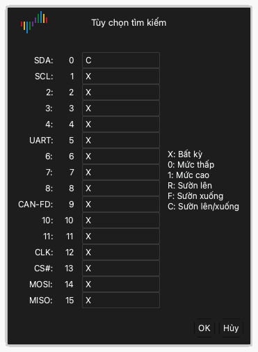

# Kiểm tra dạng sóng

Sau lần thu, vùng dạng sóng hiển thị dữ liệu của mỗi kênh dưới dạng dạng sóng.

## Di chuyển dạng sóng sang trái hoặc sang phải

Dùng một trong các cách sau:

- **Kéo.** Đặt con trỏ chuột lên dạng sóng. Giữ nút chuột trái và di chuyển chuột sang trái hoặc sang phải.
- **Kéo nhanh.** Kéo nhanh dạng sóng rồi thả nút chuột. Dạng sóng tiếp tục chuyển động. Sau đó nó chậm dần và dừng. Để bật hoặc tắt chức năng này, dùng **Cuộn dạng sóng bằng cách kéo chuột** trong tùy chọn hiển thị. Xem [Cài đặt và khởi động ứng dụng](02-install.md).
- **Thanh cuộn.** Kéo thanh cuộn ở dưới cùng cửa sổ.
- **Bàn phím.** Nhấn `Page Up` hoặc `Page Down`. Dạng sóng di chuyển một độ rộng cửa sổ.

## Phóng to và thu nhỏ

Dùng một trong các cách sau:

- **Bánh xe chuột.** Đặt con trỏ chuột lên dạng sóng và xoay bánh xe chuột. Con trỏ chuột ở giữa vùng phóng to.
- **Phóng to vùng.** Giữ nút chuột phải và kéo qua dạng sóng. Thả nút. Ứng dụng phóng to vùng bạn đã chọn.
- **Xem toàn bộ.** Nhấp đúp vào dạng sóng bằng nút chuột phải. Ứng dụng hiển thị toàn bộ dữ liệu. Nhấp đúp lại bằng nút chuột phải để trở về mức phóng trước đó.
- **Bàn phím.** Nhấn `←` để phóng to. Nhấn `→` để thu nhỏ.

## Tìm một mẫu hình

Tìm kiếm tìm một mẫu hình gồm các mức và sườn trên các kênh.

1. Nhấp **Tìm** trên thanh công cụ hoặc nhấn `R`. Thanh tìm kiếm mở ở dưới cùng cửa sổ.
2. Nhấp vào trường tìm kiếm. Cửa sổ **Tùy chọn tìm kiếm** mở ra.
3. Với mỗi kênh, nhập một trong các ký tự `X`, `0`, `1`, `R`, `F` hoặc `C`. [Kích hoạt](07-trigger.md) cho biết chức năng của mỗi ký tự.
4. Nhấp **OK**.
5. Nhấp các nút mũi tên trên thanh tìm kiếm để đến kết quả trước hoặc kết quả sau.

Ví dụ, nhập `C` cho kênh 0 và `X` cho tất cả các kênh khác. Khi đó tìm kiếm tìm mỗi sườn trên kênh 0.

## Đổi một kênh

Mỗi kênh có một nhãn ở bên trái vùng dạng sóng. Nhãn hiển thị màu, tên và số của kênh.

### Đổi màu

1. Nhấp vào vùng màu trên nhãn kênh.
2. Chọn một màu.
3. Nhấp **OK**.

### Đổi tên

1. Nhấp vào tên trên nhãn kênh.
2. Nhập tên mới.
3. Nhấn `Return`.

### Đổi thứ tự các kênh

Khi bạn đặt con trỏ chuột lên nhãn kênh, con trỏ chuột hiển thị một mũi tên. Dùng một trong các cách sau để di chuyển kênh:

- Giữ nút chuột trái trên nhãn và kéo kênh lên hoặc xuống. Thả nút tại vị trí mới.
- Nhấp vào nhãn để chọn kênh. Di chuyển chuột. Kênh di chuyển theo chuột. Nhấp lại để thả kênh tại vị trí mới.
- Giữ `Command` và nhấp nhiều nhãn. Di chuyển chuột. Các kênh đã chọn di chuyển theo chuột. Nhấp lại để thả chúng.
