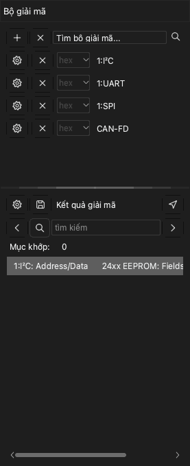

# Bộ giải mã giao thức

Bộ giải mã giao thức đọc dữ liệu của lần thu và tìm các khung của một giao thức, ví dụ UART, I2C hoặc SPI. Ứng dụng hiển thị kết quả trên một hàng mới phía trên các kênh. Ứng dụng có hơn 100 bộ giải mã.

Để mở khung neo bộ giải mã, nhấp **Giải mã** trên thanh công cụ hoặc nhấn `D`. Khung neo có hai phần:

- Danh sách bộ giải mã, với trường **Tìm bộ giải mã...** ở trên cùng.
- Danh sách **Kết quả giải mã**. Danh sách này hiển thị mỗi mục từ bộ giải mã thành một hàng văn bản.

## Thêm bộ giải mã

> [!NOTE]
> Bộ giải mã có tiền tố `0:` là phiên bản nhỏ hơn. Nó không hiển thị các bit. Bạn không thể thêm giao thức cấp cao hơn lên nó. Nó giải mã nhanh hơn và dùng ít bộ nhớ hơn.

1. Nhấp vào trường **Tìm bộ giải mã...**. Danh sách bộ giải mã mở ra.
2. Nhập một phần tên giao thức, ví dụ `I2C`. Danh sách chỉ hiển thị các bộ giải mã khớp với văn bản.
3. Nhấp vào bộ giải mã. Cửa sổ **Tùy chọn bộ giải mã** mở ra.
4. Đặt các kênh của giao thức. Ví dụ, đặt **SCL** và **SDA** cho I2C.
5. Đặt các tùy chọn giao thức, ví dụ tốc độ baud của UART.
6. Chọn các hàng kết quả mà ứng dụng hiển thị.
7. Nếu cần, đặt vùng giải mã. Xem [Giải mã một phần lần thu](#decode-region).
8. Nhấp **OK**.

Ứng dụng giải mã dữ liệu và hiển thị kết quả trên một hàng mới trong vùng dạng sóng.

Để thêm bộ giải mã khác, làm lại quy trình cho mỗi bộ giải mã.

Để đổi cài đặt của một bộ giải mã, nhấp nút cài đặt của bộ giải mã đó trong khung neo.

## Thêm bộ giải mã xếp chồng

Một số giao thức dùng một giao thức cấp thấp hơn. Ví dụ, giao thức 24xx EEPROM dùng I2C. Khi bạn thêm giao thức cấp cao hơn, ứng dụng cũng thêm các giao thức cấp thấp hơn.

1. Trong trường **Tìm bộ giải mã...**, nhập tên giao thức cấp cao hơn, ví dụ `24xx`.
2. Nhấp vào bộ giải mã.
3. Trong cửa sổ **Tùy chọn bộ giải mã**, đặt tùy chọn cho mỗi lớp giao thức.
4. Nhấp **OK**.

Kết quả hiển thị các khung của giao thức cấp thấp hơn và các lệnh, dữ liệu của giao thức cấp cao hơn.

## Giải mã một phần lần thu {#decode-region}

Thông thường, ứng dụng giải mã toàn bộ dữ liệu. Để chỉ giải mã một phần, đặt con trỏ bắt đầu và con trỏ kết thúc. Ví dụ, bạn có thể bỏ qua nhiễu khi đặt lại mạch. Vùng ngắn hơn cũng giảm thời gian giải mã.

1. Thêm hai con trỏ ở đầu và cuối vùng. Xem [Phép đo](10-measure.md).
2. Mở cửa sổ **Tùy chọn bộ giải mã** của bộ giải mã.
3. Trong danh sách **Bắt đầu**, chọn con trỏ bắt đầu.
4. Trong danh sách **Kết thúc**, chọn con trỏ kết thúc.
5. Nhấp **OK**.

## Đọc danh sách kết quả

Danh sách **Kết quả giải mã** hiển thị các mục từ bộ giải mã theo thứ tự thời gian. Nhấp vào một hàng để di chuyển dạng sóng đến mục đó.

Để đổi các cột mà danh sách hiển thị, nhấp nút cài đặt ở đầu danh sách.

## Tìm văn bản trong kết quả

1. Nhập văn bản vào trường tìm kiếm của danh sách **Kết quả giải mã**.
2. Nhấp mũi tên phải để đến hàng tiếp theo chứa văn bản đó. Nhấp mũi tên trái để đến hàng trước.

Dạng sóng di chuyển đến mục của mỗi hàng mà tìm kiếm tìm thấy. Nếu bạn nhấp vào một hàng trước, tìm kiếm bắt đầu tại hàng đó.

Để tìm một chuỗi byte, đặt dấu `-` giữa các byte. Ví dụ, `70-70-70` tìm ba byte liên tiếp có giá trị 70.

> [!NOTE]
> Tìm chuỗi byte chỉ hoạt động với bộ giải mã UART, I2C và SPI.

## Xuất kết quả

1. Nhấp nút lưu ở đầu danh sách **Kết quả giải mã**. Cửa sổ **Xuất giao thức** mở ra.
2. Trong **Định dạng xuất**, chọn CSV hoặc TXT.
3. Chọn mỗi cột bạn muốn xuất. Ứng dụng đặt tất cả các cột vào một tệp, theo thứ tự thời gian.
4. Nhấp **OK**.
5. Chọn thư mục và nhập tên tệp.
6. Nhấp **Lưu**.

## Xóa bộ giải mã

- Để xóa một bộ giải mã, nhấp nút **×** trên hàng của bộ giải mã đó.
- Để xóa tất cả bộ giải mã, nhấp nút **×** ở đầu khung neo, cạnh nút **+**.
