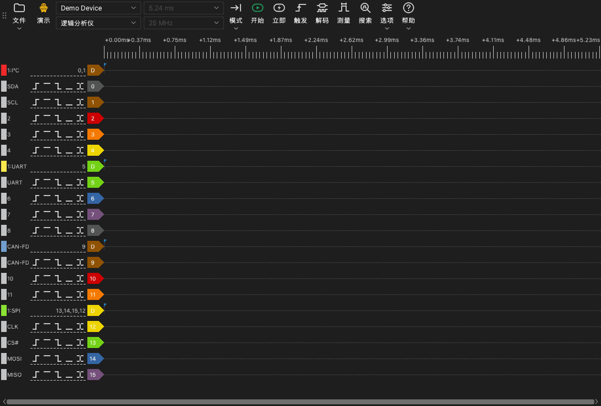

# 主窗口

## 主窗口的组成部分

主窗口有以下部分：

- **工具栏。** 工具栏包含设备、采集和工具的控件。
- **波形区。** 波形区为每个通道显示一行。时间标尺位于这些行的上方。
- **通道标签。** 每行左侧的标签显示通道编号、名称和触发按钮。
- **停靠面板。** 停靠面板是波形区旁边的面板。触发、解码器、测量和搜索工具在停靠面板中打开。

## 工具栏

工具栏从起始处到末尾有以下项目：

| 项目 | 功能 |
| --- | --- |
| **文件** | 用于打开、保存和导出数据以及保存会话的菜单。参阅[文件和会话](12-files.md)。 |
| 设备类型 | 显示连接类型的标签：**USB 2.0**、**USB 3.0**、**演示** 或 **文件**。 |
| 设备列表 | 应用使用的设备。在此处选择其他设备或演示设备。 |
| 设备模式 | **逻辑分析仪**、**示波器** 或 **数据记录仪**。列表只显示该设备可用的模式。 |
| 采样时长 | 一次采集的时间长度。 |
| 采样率 | 每个通道每秒的采样点数。 |
| **模式** | 采集模式：**单次**、**重复** 或 **滚动**。 |
| **开始** | 开始采集。采集期间，此按钮变为 **停止**。 |
| **立即** | 开始一次不等待触发的采集。 |
| **触发** | 打开触发停靠面板。 |
| **解码** | 打开解码器停靠面板。 |
| **测量** | 打开测量停靠面板。 |
| **搜索** | 打开搜索栏。 |
| **选项** | 包含 **设备选项...** 和 **显示** 菜单的菜单。 |
| **帮助** | 包含语言、本手册、更新页面、日志选项和问题报告页面的菜单。 |

设备类型标签显示以下值：

- **USB 3.0**：设备使用 USB 3.0 连接。
- **USB 2.0**：设备使用 USB 2.0 连接。如果设备有 USB 3.0 接口，把它连接到 USB 3.0 端口。在 Stream模式下，USB 2.0 连接会降低最高采样率。
- **演示**：设备是演示设备。演示设备产生测试信号。用它试用应用的功能。
- **文件**：应用显示文件中的数据。没有设备。

## 键盘快捷键

| 键 | 功能 |
| --- | --- |
| `S` | 开始或停止采集。 |
| `I` | 开始或停止立即采集。在示波器模式下，执行一次采集后停止。 |
| `T` | 打开或关闭触发停靠面板。 |
| `D` | 打开或关闭解码器停靠面板。 |
| `M` | 打开或关闭测量停靠面板。 |
| `R` | 打开或关闭搜索栏。 |
| `O` | 打开 **设备选项** 窗口。 |
| `Page Up` | 把波形向左移动一个窗口宽度。 |
| `Page Down` | 把波形向右移动一个窗口宽度。 |
| `←` | 放大。 |
| `→` | 缩小。 |
| `0`, `1` | 在示波器模式下，选择或释放通道 0 或通道 1 的刻度控件。 |
| `↑`, `↓` | 在示波器模式下，更改所选通道的垂直刻度。 |

波形区获得键盘焦点时，快捷键才起作用。
