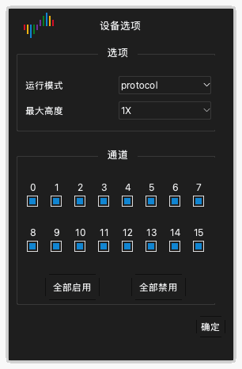

# 设备选项

## 打开设备选项

1. 单击工具栏上的 **选项** › **设备选项...**。您也可以按 `O`。
2. 在 **设备选项** 窗口中更改设置。
3. 单击 **确定**。

窗口中的设置因设备型号而不同。本章给出 DSLogic Plus 的设置。

> [!NOTE]
> 采集期间不能更改设备选项。

## 运行模式

**运行模式** 设置选择设备向计算机发送数据的方式。

**Buffer模式。** 采集期间，设备把采样点保存在内部内存中。采集之后，设备通过 USB 把数据发送到计算机。内存比 USB 快。因此，Buffer模式提供最高的采样率。内存容量限制采集的长度。对快速信号和短采集使用 Buffer模式。

**Stream模式。** 采集期间，设备把采样点发送到计算机。计算机的内存限制采集的长度。采集期间您可以看到数据。USB 连接的速度限制采样率。对慢速信号和长采集使用 Stream模式。

**内部测试。** 此模式只用于测试设备。不要用它进行测量。

## 停止选项

**停止选项** 设置只适用于 Buffer模式。它设置在采集结束之前停止采集时应用的操作。

- **立即停止**：应用不从设备获取数据。应用不显示数据。
- **上传已采集的数据**：应用获取设备在停止之前记录的数据。应用显示这些数据。

## 阈值电压

**阈值电压** 设置是区分低电平和高电平的电压。高于阈值的信号是高电平。低于阈值的信号是低电平。

您可以设置 0.0 V 到 5.0 V 的值，步长为 0.1 V。把阈值设为电路逻辑电压的约 50%。对于 3.3 V 电路，设置约 1.6 V。

## 滤波器设置

**滤波器设置** 设置从数据中去除短脉冲。

- **无**：应用显示所有采样点。
- **1个采样周期**：应用去除每个短于一个采样周期的脉冲。

## 最大高度

**最大高度** 设置波形区中每个通道行的最大高度。**1X** 是一个高度单位。只显示少量通道时，使用较大的值。

## RLE硬件压缩

选择 **RLE硬件压缩** 后，设备压缩其内存中的数据（游程编码）。此设置只适用于 Buffer模式。如果信号的边沿较少，设备可以在内存中保存更长的采集。如果信号的边沿很多，压缩不会增加长度。

## 使用外部输入时钟采样

选择 **使用外部输入时钟采样** 后，设备在 CK 线上的每个时钟边沿对通道采样。设备不使用内部时钟。用此设置记录带有时钟信号的总线。

## 使用时钟下降沿采样

此设置只在选择 **使用外部输入时钟采样** 时适用。通常，设备在时钟的上升沿对通道采样。选择 **使用时钟下降沿采样** 后，设备在时钟的下降沿对通道采样。

## 通道模式

通道模式设置设备可以使用的通道数。它也设置最高采样率。通道数越少，最高采样率越高。选择与信号数量和频率相符的通道模式。

DSLogic Plus 的通道模式如下：

| 运行模式 | 通道模式 | 最高采样率 |
| --- | --- | --- |
| Buffer模式 | 通道 0 到 15 | 100 MHz |
| Buffer模式 | 通道 0 到 7 | 200 MHz |
| Buffer模式 | 通道 0 到 3 | 400 MHz |
| Stream模式 | 16 个通道 | 20 MHz |
| Stream模式 | 12 个通道 | 25 MHz |
| Stream模式 | 6 个通道 | 50 MHz |
| Stream模式 | 3 个通道 | 100 MHz |

## 启用和禁用通道

在通道模式下方，窗口为每个通道显示一个复选框。

1. 选中您使用的每个通道的复选框。
2. 清除您不使用的每个通道的复选框。
3. 要选中所有通道，单击 **全部启用**。要清除所有通道，单击 **全部禁用**。

在 Stream模式下，启用的通道越少，可用的采样率越高。
