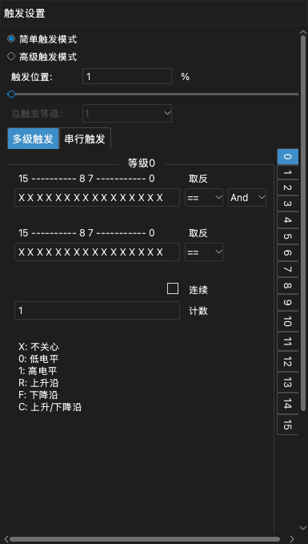
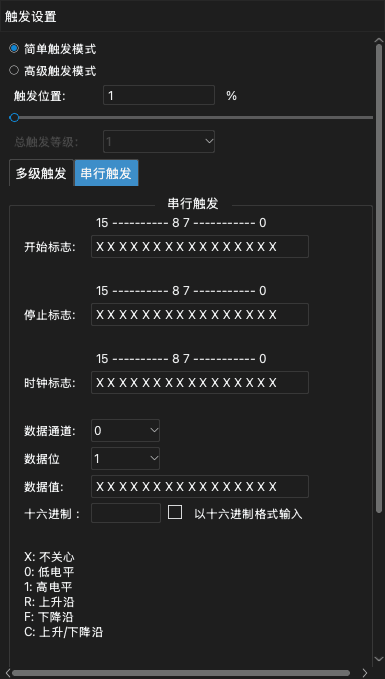

# 触发

触发是信号中的一个条件。条件发生时，设备把该时间标记为触发点。触发使您能够采集要检查的那部分信号。

应用有两种触发：

- **简单触发模式**：一个或多个通道上的边沿或电平。
- **高级触发模式**：一系列条件，或串行总线上的一个值。

要打开触发停靠面板，单击工具栏上的 **触发** 或按 `T`。

> [!NOTE]
> 如果信号不符合触发条件，采集会一直等待。要不使用触发查看信号，单击 **立即**。要停止等待，单击 **停止**。

## 触发位置

**触发位置** 设置触发点在采集中的位置。该值是采样时长的百分比。

- 较小的值（例如 10%）显示更多触发之后的信号。
- 较大的值（例如 90%）显示更多触发之前的信号。

触发位置使用设备的内存。因此，只能在 Buffer模式下设置触发位置。在 Stream模式下，触发位置始终约为 1%。

<!-- TODO: new screenshot -->

## 简单触发

波形区中的每个通道标签有五个触发按钮。从左到右，这些按钮是：

1. 上升沿
2. 高电平
3. 下降沿
4. 低电平
5. 上升沿或下降沿

要设置简单触发，执行以下步骤：

1. 打开触发停靠面板。
2. 选择 **简单触发模式**。
3. 在通道的标签上，单击您需要的触发按钮。该按钮以不同的颜色显示。
4. 要删除通道上的触发，再次单击同一个按钮。
5. 设置 **触发位置**。

如果在多个通道上设置触发，所有条件必须在同一个采样点发生（逻辑与）。

## 高级触发

> [!NOTE]
> 高级触发只在 Buffer模式下可用。要使用高级触发，把 **运行模式** 设为 **Buffer模式**。参阅[设备选项](05-device-options.md)。

要使用高级触发，在触发停靠面板中选择 **高级触发模式**。然后选择 **多级触发** 选项卡或 **串行触发** 选项卡。

### 每个通道的值

多级触发和串行触发使用一行 16 个字符。每个字符是一个通道的条件。最右边的字符是通道 0。最左边的字符是通道 15。

| 字符 | 条件 |
| --- | --- |
| `X` | 所有值（该通道不起作用）。 |
| `0` | 低电平。 |
| `1` | 高电平。 |
| `R` | 上升沿。 |
| `F` | 下降沿。 |
| `C` | 上升沿或下降沿。 |

### 多级触发

多级触发是一系列条件。每个条件是一级。设备首先检查第 0 级。某一级的条件发生时，设备进入下一级。最后一级完成时，触发发生。最多可以使用 16 级。

每一级有以下设置：

- 两行通道条件。
- 每一行的 `==` 或 `!=`。使用 `==` 时，通道与该行相符则条件发生。使用 `!=` 时，通道与该行不相符则条件发生。
- **And** 或 **Or**。此设置连接两行。
- **计数**：该级完成之前条件必须发生的次数。
- **连续**：选中此复选框时，条件必须在连续的采样点中发生，不能中断。

要设置多级触发，执行以下步骤：

1. 在 **总触发等级** 中选择级数。
2. 在右侧的级列表中，单击第 0 级。
3. 在第一行中输入通道条件。
4. 如有必要，在第二行中输入通道条件，然后选择 **And** 或 **Or**。
5. 在 **计数** 中输入一个值。
6. 对其他每一级重复步骤 2 到 5。

以下是三个示例。

**示例 1。** 通道 0 保持高电平超过 1000 个采样点时触发：

1. 把 **总触发等级** 设为 1。
2. 在第 0 级的第一行中，为通道 0 输入 `1`。
3. 选择 **连续**。
4. 把 **计数** 设为 1000。

**示例 2。** 通道 0 上升沿或通道 1 下降沿时触发：

1. 把 **总触发等级** 设为 1。
2. 在第 0 级的第一行中，为通道 0 输入 `R`。
3. 在第二行中，为通道 1 输入 `F`。
4. 选择 **Or**。

**示例 3。** 通道 0 上升沿，然后通道 1 出现 100 个下降沿，然后通道 2 为高电平时触发：

1. 把 **总触发等级** 设为 3。
2. 在第 0 级中，为通道 0 输入 `R`。
3. 在第 1 级中，为通道 1 输入 `F`。把 **计数** 设为 100。
4. 在第 2 级中，为通道 2 输入 `1`。

### 串行触发

串行触发在串行总线上查找一个数据值。它像移位寄存器一样工作。设置如下：

- **开始标志**：启动串行触发的条件。
- **停止标志**：清除移位寄存器的条件。
- **时钟标志**：向移位寄存器添加一位的条件。
- **数据通道**：传输数据的通道。
- **数据位**：值的位数。
- **数据值**：引起触发的值。

开始标志发生后，设备在每个时钟标志处读取数据通道。设备把这一位移入移位寄存器。移位寄存器的最后几位等于 **数据值** 时，触发发生。停止标志发生时，设备清除移位寄存器。

**示例 4。** I2C 总线上出现值 `010000100` 时触发。通道 0 是 SCL，通道 1 是 SDA。

1. 把 **开始标志** 设为 SCL 为高电平时 SDA 的下降沿：在最右边的两个字符中输入 `F1`。
2. 把 **停止标志** 设为 SCL 为高电平时 SDA 的上升沿：`R1`。
3. 把 **时钟标志** 设为 SCL 的上升沿：为通道 0 输入 `R`。
4. 把 **数据通道** 设为 1。
5. 把 **数据位** 设为 9。
6. 在 **数据值** 中输入 `010000100`。

**示例 5。** SPI 总线的 MOSI 上出现值 `0x1234` 时触发。通道 0 是 CS#，通道 1 是 CLK，通道 2 是 MISO，通道 3 是 MOSI。

1. 把 **开始标志** 设为 CS# 的下降沿：为通道 0 输入 `F`。
2. 把 **停止标志** 设为 CS# 的上升沿：为通道 0 输入 `R`。
3. 把 **时钟标志** 设为 CLK 的上升沿：为通道 1 输入 `R`。
4. 把 **数据通道** 设为 3。
5. 把 **数据位** 设为 16。
6. 在 **数据值** 中输入 `0001001000110100`。

要以十六进制输入值，选择 **以十六进制格式输入**。然后在 **十六进制** 输入框中输入该值。
