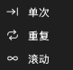

# 采集数据

开始采集之前，设置以下项目：

1. 设备选项。参阅[设备选项](05-device-options.md)。
2. 采样率和采样时长。参阅[采样率和采样时长](06-sample-rate.md)。
3. 触发（如有必要）。参阅[触发](07-trigger.md)。
4. 采集模式。参阅[采集模式](#capture-modes)。

## 开始采集

采集有两种：

- **开始** 开始一次标准采集。如果您设置了触发，设备等待触发。
- **立即** 立即开始一次采集。设备不使用触发设置。

要开始标准采集，单击 **开始** 或按 `S`。要开始立即采集，单击 **立即** 或按 `I`。采集期间，该按钮变为 **停止**。单击 **停止** 停止采集。

### Buffer模式下标准采集的过程

1. 您单击 **开始**。
2. 应用把设置发送到设备。
3. 如果没有触发，设备立即开始记录。如果有触发，设备等待触发。
4. 设备一直记录，直到采样时长结束或内存已满。
5. 设备把数据发送到计算机。
6. 应用在波形区中显示波形。

### Stream模式下标准采集的过程

1. 您单击 **开始**。
2. 应用把设置发送到设备。
3. 如果有触发，设备等待触发。在滚动模式下，设备不使用触发。
4. 采集期间，设备把数据发送到计算机。
5. 采集期间，应用显示波形。
6. 采集在采样时长结束时停止。在滚动模式下，采集一直继续，直到您单击 **停止**。

## 使用立即采集

立即采集与标准采集相同，但不使用触发设置。在以下情况下使用立即采集：

- 因为触发条件没有发生，标准采集等待了很长时间。
- 您想查看此时的信号。
- 您想在更改触发之前检查信号。

如果没有信号，标准采集在触发位置等待。状态显示 **等待触发!**。立即采集立即记录信号。

## 采集模式 {#capture-modes}

要选择采集模式，单击工具栏上的 **模式**。然后选择以下项目之一：

| 采集模式 | Buffer模式 | Stream模式 |
| --- | --- | --- |
| **单次** | 是 | 是 |
| **重复** | 是 | 是 |
| **滚动** | 否 | 是 |

### 单次

设备执行一次采集。然后采集停止。

在 Buffer模式下，应用在采集之后显示波形。在 Stream模式下，应用在采集期间显示波形。

用此模式采集一个信号条件，或采集此时的波形。

### 重复

设备执行一次采集。然后设备自动开始下一次采集。这一过程一直继续，直到您单击 **停止**。

在 Buffer模式下，应用显示一个窗口，用于设置两次采集之间的间隔。您可以设置 0.1 s 到 10 s 的值。

用此模式查看多次发生的信号条件。例如，用它查看每次电路复位后或每次按下按钮后的信号。与触发一起使用此模式。

### 滚动

此模式只在 Stream模式下可用。采集一直继续，直到您单击 **停止**。数据长于采样时长时，最早的数据从窗口左侧移出。最新的数据从右侧移入。应用丢弃移出的数据。

不知道信号条件何时发生时，使用此模式。采集期间观察波形。看到该条件时，单击 **停止**。

> [!NOTE]
> 在滚动模式下，设备不使用触发设置。

## 采集状态

采集期间，波形区显示状态：

- **等待触发!**：设备等待触发条件。
- **已触发!**：触发已发生。
- **% 已采集**：采集已完成的百分比。

采集之后，波形区底部显示 **触发时间**。
