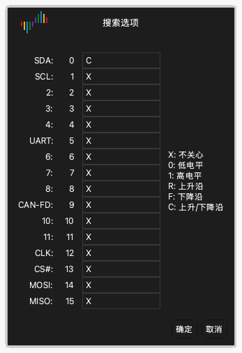

# 查看波形

采集之后，波形区把每个通道的数据显示为波形。

## 向左或向右移动波形

使用以下方法之一：

- **拖动。** 把指针放在波形上。按住鼠标左键，向左或向右移动鼠标。
- **快速拖动。** 快速拖动波形，然后松开鼠标按钮。波形继续移动。然后波形移动变慢并停止。要打开或关闭此功能，使用显示选项中的 **基于鼠标拖拽的波形滚动**。参阅[安装和启动应用](02-install.md)。
- **滚动条。** 拖动窗口底部的滚动条。
- **键盘。** 按 `Page Up` 或 `Page Down`。波形移动一个窗口宽度。

## 放大和缩小

使用以下方法之一：

- **鼠标滚轮。** 把指针放在波形上，转动鼠标滚轮。指针保持在缩放的中心。
- **区域缩放。** 按住鼠标右键，在波形上拖动。松开按钮。应用放大您选择的区域。
- **全部显示。** 用鼠标右键双击波形。应用显示所有数据。再次用鼠标右键双击，返回上一个缩放。
- **键盘。** 按 `←` 放大。按 `→` 缩小。

## 查找模式

搜索在通道上查找电平和边沿的模式。

1. 单击工具栏上的 **搜索** 或按 `R`。搜索栏在窗口底部打开。
2. 单击搜索框。**搜索选项** 窗口打开。
3. 为每个通道输入字符 `X`、`0`、`1`、`R`、`F` 或 `C` 之一。[触发](07-trigger.md)给出每个字符的作用。
4. 单击 **确定**。
5. 单击搜索栏中的箭头按钮，转到上一个结果或下一个结果。

例如，为通道 0 输入 `C`，为其他所有通道输入 `X`。然后搜索找到通道 0 上的每个边沿。

## 更改通道

每个通道在波形区左侧有一个标签。标签显示通道的颜色、名称和编号。

### 更改颜色

1. 单击通道标签上的颜色区域。
2. 选择一种颜色。
3. 单击 **确定**。

### 更改名称

1. 单击通道标签上的名称。
2. 输入新名称。
3. 按 `Return`。

### 更改通道的顺序

把指针放在通道标签上时，指针显示一个箭头。使用以下方法之一移动通道：

- 在标签上按住鼠标左键，向上或向下拖动通道。在新位置松开按钮。
- 单击标签以选择通道。移动鼠标。通道随鼠标移动。在新位置再次单击以释放通道。
- 按住 `Command` 并单击多个标签。移动鼠标。所选通道随鼠标移动。再次单击以释放这些通道。
