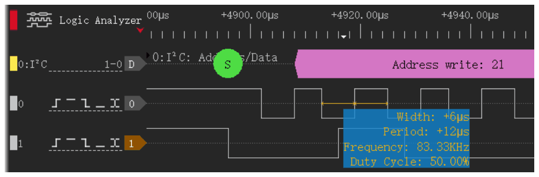
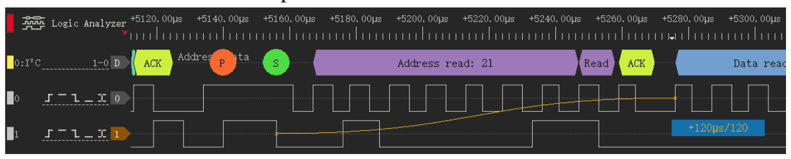
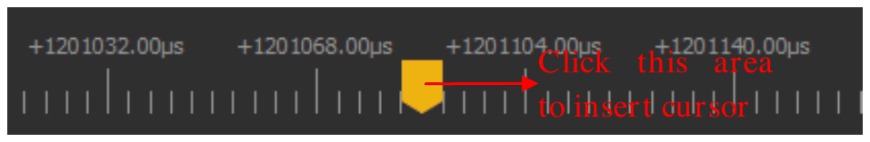
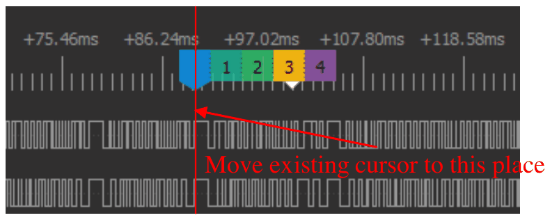
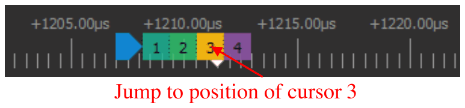

# 测量

您可以用鼠标或光标测量波形。光标是采集中某一时间处的一条竖线。

## 用指针测量脉冲

把指针放在通道的一个脉冲上。指针附近的一个框显示该脉冲的以下值：

- **宽度**：脉冲的时间长度。
- **周期**：从一个边沿到同方向的下一个边沿的时间。
- **频率**：1 除以周期。
- **占空比**：高电平时间占周期的百分比。

要打开或关闭此框，打开测量停靠面板并使用 **启用浮动测量**。

## 统计一个区域内的边沿

1. 把指针放在该通道的波形上，位于高电平和低电平之间。
2. 把指针移到区域的起点。
3. 单击鼠标左键。
4. 把指针移到区域的终点。应用显示边沿、上升沿和下降沿的数量。
5. 再次单击鼠标左键完成测量。

## 测量两个边沿之间的时间

1. 把指针放在第一个边沿上。
2. 单击鼠标左键。
3. 把指针移到第二个边沿。应用显示两个边沿之间的时间和采样点数。
4. 再次单击鼠标左键完成测量。

## 添加光标

使用以下方法之一：

- 在波形区中，在需要的时间处双击鼠标左键。如果指针靠近边沿，光标移到该边沿。
- 在时间标尺中单击鼠标左键。标尺上显示一个箭头。单击该箭头添加光标。

每个光标有一个编号。编号从 1 开始。

## 移动光标

使用以下方法之一：

- 把指针放在光标上。光标线变粗。单击光标。移动鼠标。再次单击以释放光标。靠近边沿时，光标移到该边沿。
- 在时间标尺中，在新的时间处单击鼠标左键。标尺显示所有光标的编号。单击要移动的光标的编号。

## 转到光标

1. 在时间标尺中单击鼠标右键。标尺显示所有光标的编号。
2. 单击一个光标的编号。波形移到该光标的位置。

## 用光标测量

要打开测量停靠面板，单击工具栏上的 **测量** 或按 `M`。停靠面板有以下组：

- **光标距离**：两个光标之间的时间和采样点数。
- **边沿**：两个光标之间一个通道上的边沿数。
- **光标**：每个光标的时间和采样点编号。

要添加时间测量，执行以下步骤：

1. 在 **光标距离** 组中，单击 **+** 按钮。
2. 单击起始框，选择第一个光标。
3. 单击结束框，选择第二个光标。

停靠面板在 **时间/采样点个数** 列中显示结果。

要添加边沿计数，执行以下步骤：

1. 在 **边沿** 组中，单击 **+** 按钮。
2. 选择起始光标和结束光标。
3. 选择通道。

停靠面板显示上升沿、下降沿和所有边沿的数量。

要删除一项测量，单击其所在行上的 **×** 按钮。

## 删除光标

使用以下方法之一：

- 单击时间标尺中光标标签上的 **×**。
- 在测量停靠面板的 **光标** 组中，单击该光标的 **×** 按钮。

应用为剩下的光标重新编号。
