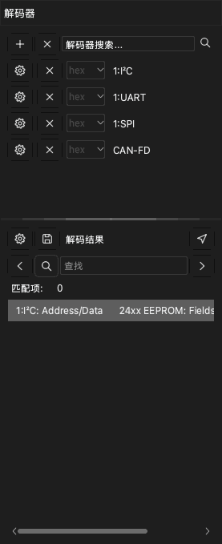
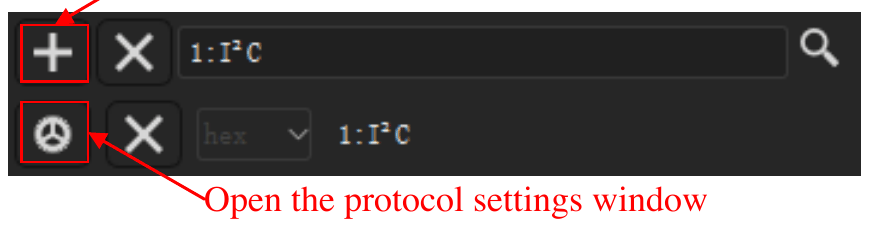
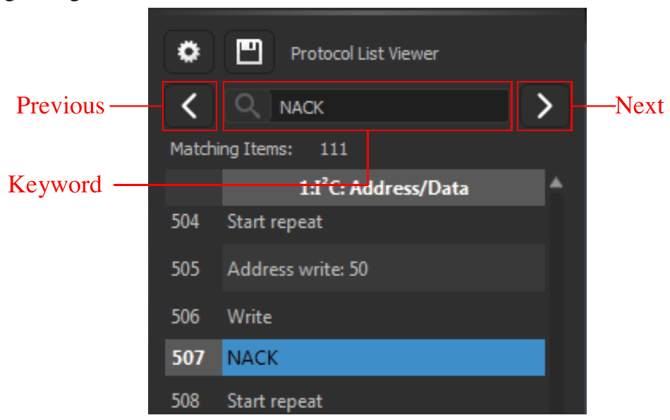
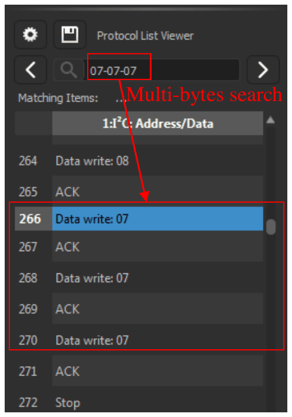
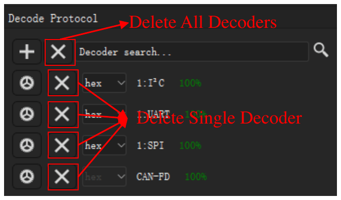

# 协议解码器

协议解码器读取采集的数据，并找到协议的帧，例如 UART、I2C 或 SPI。应用把结果显示为通道上方的新行。应用有 100 多个解码器。

要打开解码器停靠面板，单击工具栏上的 **解码** 或按 `D`。停靠面板有两部分：

- 解码器列表，顶部有 **解码器搜索** 输入框。
- **解码结果** 列表。此列表把解码器的每一项显示为一行文本。

## 添加解码器

> [!NOTE]
> 带有前缀 `0:` 的解码器是精简版本。它不显示位。您不能在它上面添加更高层的协议。它解码更快，使用的内存更少。

1. 单击 **解码器搜索** 输入框。解码器列表打开。
2. 输入协议名称的一部分，例如 `I2C`。列表只显示与该文本相符的解码器。
3. 单击解码器。**解码器选项** 窗口打开。
4. 设置协议的通道。例如，为 I2C 设置 **SCL** 和 **SDA**。
5. 设置协议选项，例如 UART 的波特率。
6. 选择应用显示的结果行。
7. 如有必要，设置解码区域。参阅[解码采集的一部分](#decode-region)。
8. 单击 **确定**。

应用解码数据，并在波形区的新行中显示结果。

要添加更多解码器，对每个解码器重复此步骤。

要更改解码器的设置，在停靠面板中单击该解码器的设置按钮。

## 添加堆叠解码器

一些协议使用更低层的协议。例如，24xx EEPROM 协议使用 I2C。添加更高层的协议时，应用也添加更低层的协议。

1. 在 **解码器搜索** 输入框中，输入更高层协议的名称，例如 `24xx`。
2. 单击解码器。
3. 在 **解码器选项** 窗口中，设置每个协议层的选项。
4. 单击 **确定**。

结果显示更低层协议的帧，以及更高层协议的命令和数据。

## 解码采集的一部分 {#decode-region}

通常，应用解码所有数据。要只解码一部分，设置一个起始光标和一个结束光标。例如，您可以忽略电路复位时的噪声。较短的区域也会减少解码时间。

1. 在区域的起点和终点添加两个光标。参阅[测量](10-measure.md)。
2. 打开该解码器的 **解码器选项** 窗口。
3. 在 **开始** 列表中，选择起始光标。
4. 在 **结束** 列表中，选择结束光标。
5. 单击 **确定**。

## 阅读结果列表

**解码结果** 列表按时间顺序显示解码器的各项。单击一行，波形移到该项。

要更改列表显示的列，单击列表顶部的设置按钮。

## 在结果中查找文本

1. 在 **解码结果** 列表的搜索框中输入文本。
2. 单击右箭头，转到包含该文本的下一行。单击左箭头，转到上一行。

搜索找到的每一行，波形都会移到该行的项。如果先单击一行，搜索从该行开始。

要查找一串字节，在字节之间加符号 `-`。例如，`70-70-70` 查找三个连续的值为 70 的字节。

> [!NOTE]
> 字节串搜索只适用于 UART、I2C 和 SPI 解码器。

## 导出结果

1. 单击 **解码结果** 列表顶部的保存按钮。**协议导出** 窗口打开。
2. 在 **导出格式** 中，选择 CSV 或 TXT。
3. 选择您要导出的每一列。应用按时间顺序把所有列放入一个文件。
4. 单击 **确定**。
5. 选择文件夹并输入文件名。
6. 单击 **保存**。

## 删除解码器

- 要删除一个解码器，单击该解码器所在行上的 **×** 按钮。
- 要删除所有解码器，单击停靠面板顶部 **+** 按钮旁边的 **×** 按钮。
