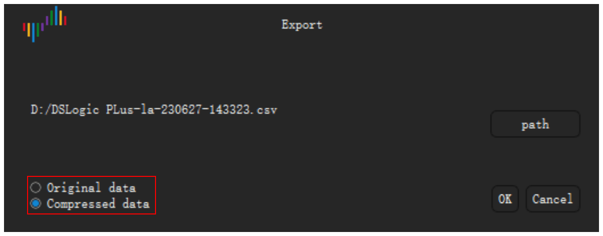

# 文件和会话

单击工具栏上的 **文件** 打开文件菜单。菜单有以下项目：

- **配置**：用于加载和保存会话的菜单。
- **打开**：打开数据文件。
- **保存**：保存采集的数据。
- **导出**：把数据导出为其他格式。
- **截屏**：保存窗口的图像。

## 会话

会话文件包含设置，但不包含采集的数据。会话包括设备选项、启用的通道、通道的名称和颜色以及触发设置。会话文件的扩展名为 `.dsc`。

### 保存会话

1. 单击 **文件** › **配置** › **保存配置**。
2. 选择文件夹并输入文件名。
3. 单击 **保存**。

### 加载会话

1. 单击 **文件** › **配置** › **加载配置**。
2. 选择会话文件。
3. 单击 **打开**。

### 恢复初始设置

单击 **文件** › **配置** › **加载默认配置**。应用把设备的所有设置恢复为初始值。

退出时，应用自动保存设置。再次启动时，应用加载上一次会话的设置。

## 保存数据

1. 单击 **文件** › **保存**。
2. 选择文件夹并输入文件名。
3. 单击 **保存**。

应用把数据和设置保存在扩展名为 `.dsl` 的文件中。您可以在 Logic Analyze 中再次打开此文件。

> [!CAUTION]
> 应用不会自动保存数据。开始新的采集或退出应用之前，保存数据。新的采集会替换上一次采集的数据。

## 打开数据文件

1. 单击 **文件** › **打开**。
2. 选择扩展名为 `.dsl` 的文件。
3. 单击 **打开**。

应用在波形区中显示数据。设备类型标签显示 **文件**。

## 导出数据

导出生成其他程序可以读取的文件。

1. 单击 **文件** › **导出**。**导出** 窗口打开。
2. 单击 **路径**。
3. 选择文件夹，输入文件名，然后选择格式。
4. 单击 **保存**。
5. 如果格式是 CSV，选择 **原始数据** 或 **压缩数据**。压缩数据只在值每次变化时包含一行。
6. 单击 **确定**。

在逻辑分析仪模式下，可以使用以下格式：

| 格式 | 扩展名 | 用途 |
| --- | --- | --- |
| CSV | `.csv` | 电子表格程序和脚本。 |
| VCD | `.vcd` | 波形程序，例如 GTKWave。 |
| Gnuplot | `.gnuplot` | Gnuplot 程序。 |
| srzip | `.srzip` | sigrok 程序，例如 PulseView。 |

在示波器模式和数据记录仪模式下，只能使用 CSV。

<!-- TODO: new screenshot -->

## 保存窗口的图像

1. 单击 **文件** › **截屏**。
2. 选择文件夹并输入文件名。
3. 选择 PNG 或 JPEG。
4. 单击 **保存**。
