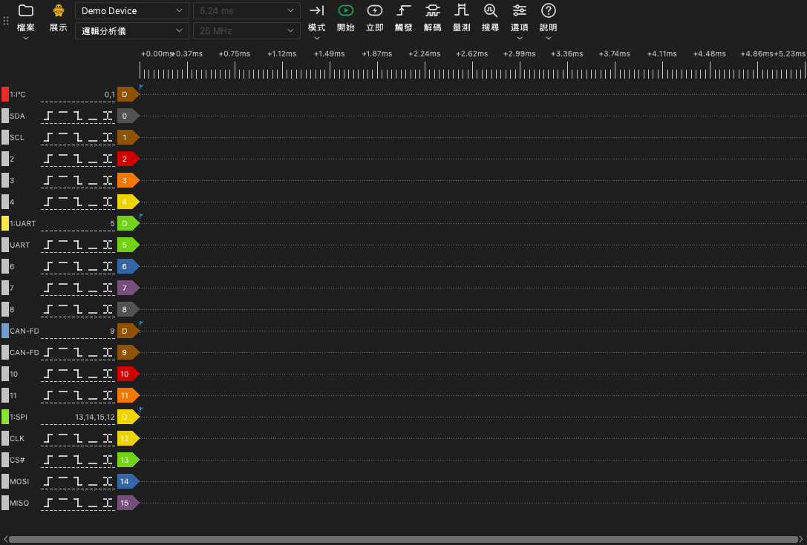

# 主視窗

## 主視窗的組成部分

主視窗有以下部分：

- **工具列。** 工具列包含裝置、擷取和工具的控制項。
- **波形區。** 波形區為每個通道顯示一列。時間尺規位於這些列的上方。
- **通道標籤。** 每列左側的標籤顯示通道編號、名稱和觸發按鈕。
- **停駐面板。** 停駐面板是波形區旁邊的面板。觸發、解碼器、量測和搜尋工具在停駐面板中開啟。

## 工具列

工具列從起始處到結尾有以下項目：

| 項目 | 功能 |
| --- | --- |
| **檔案** | 用於開啟、儲存和匯出資料以及儲存工作階段的選單。請參閱[檔案和工作階段](12-files.md)。 |
| 裝置類型 | 顯示連線類型的標籤：**USB 2.0**、**USB 3.0**、**展示** 或 **檔案**。 |
| 裝置清單 | 應用程式使用的裝置。在此處選取其他裝置或展示裝置。 |
| 裝置模式 | **邏輯分析儀**、**示波器** 或 **資料擷取**。清單只顯示該裝置可用的模式。 |
| 取樣時長 | 一次擷取的時間長度。 |
| 取樣率 | 每個通道每秒的取樣數。 |
| **模式** | 擷取模式：**單次**、**重複** 或 **循環**。 |
| **開始** | 開始擷取。擷取期間，此按鈕變為 **停止**。 |
| **立即** | 開始一次不等待觸發的擷取。 |
| **觸發** | 開啟觸發停駐面板。 |
| **解碼** | 開啟解碼器停駐面板。 |
| **量測** | 開啟量測停駐面板。 |
| **搜尋** | 開啟搜尋列。 |
| **選項** | 包含 **裝置選項...** 和 **顯示** 選單的選單。 |
| **說明** | 包含語言、本手冊、更新頁面、記錄選項和問題回報頁面的選單。 |

裝置類型標籤顯示以下值：

- **USB 3.0**：裝置使用 USB 3.0 連線。
- **USB 2.0**：裝置使用 USB 2.0 連線。如果裝置有 USB 3.0 介面，把它連接到 USB 3.0 連接埠。在串流模式下，USB 2.0 連線會降低最高取樣率。
- **展示**：裝置是展示裝置。展示裝置產生測試訊號。用它試用應用程式的功能。
- **檔案**：應用程式顯示檔案中的資料。沒有裝置。

## 鍵盤快速鍵

| 按鍵 | 功能 |
| --- | --- |
| `S` | 開始或停止擷取。 |
| `I` | 開始或停止立即擷取。在示波器模式下，執行一次擷取後停止。 |
| `T` | 開啟或關閉觸發停駐面板。 |
| `D` | 開啟或關閉解碼器停駐面板。 |
| `M` | 開啟或關閉量測停駐面板。 |
| `R` | 開啟或關閉搜尋列。 |
| `O` | 開啟 **裝置選項** 視窗。 |
| `Page Up` | 把波形向左移動一個視窗寬度。 |
| `Page Down` | 把波形向右移動一個視窗寬度。 |
| `←` | 放大。 |
| `→` | 縮小。 |
| `0`, `1` | 在示波器模式下，選取或釋放通道 0 或通道 1 的刻度控制項。 |
| `↑`, `↓` | 在示波器模式下，變更所選通道的垂直刻度。 |

波形區取得鍵盤焦點時，快速鍵才有作用。
