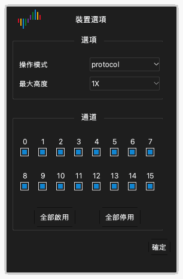

# 裝置選項

## 開啟裝置選項

1. 按一下工具列上的 **選項** › **裝置選項...**。您也可以按 `O`。
2. 在 **裝置選項** 視窗中變更設定。
3. 按一下 **確定**。

視窗中的設定因裝置型號而不同。本章提供 DSLogic Plus 的設定。

> [!NOTE]
> 擷取期間不能變更裝置選項。

## 操作模式

**操作模式** 設定選取裝置向電腦傳送資料的方式。

**緩衝模式。** 擷取期間，裝置把取樣保存在內部記憶體中。擷取之後，裝置透過 USB 把資料傳送到電腦。記憶體比 USB 快。因此，緩衝模式提供最高的取樣率。記憶體容量限制擷取的長度。對快速訊號和短擷取使用緩衝模式。

**串流模式。** 擷取期間，裝置把取樣傳送到電腦。電腦的記憶體限制擷取的長度。擷取期間您可以看到資料。USB 連線的速度限制取樣率。對慢速訊號和長擷取使用串流模式。

**內部測試。** 此模式只用於測試裝置。不要用它進行量測。

## 停止選項

**停止選項** 設定只適用於緩衝模式。它設定在擷取結束之前停止擷取時應用程式的動作。

- **立即停止**：應用程式不從裝置取得資料。應用程式不顯示資料。
- **上傳已擷取的資料**：應用程式取得裝置在停止之前記錄的資料。應用程式顯示這些資料。

## 臨界電壓

**臨界電壓** 設定是區分低準位和高準位的電壓。高於臨界值的訊號是高準位。低於臨界值的訊號是低準位。

您可以設定 0.0 V 到 5.0 V 的值，間隔為 0.1 V。把臨界值設為電路邏輯電壓的約 50%。對於 3.3 V 電路，設定約 1.6 V。

## 濾波目標

**濾波目標** 設定從資料中移除短脈衝。

- **無**：應用程式顯示所有取樣。
- **1 個取樣時脈**：應用程式移除每個短於一個取樣週期的脈衝。

## 最大高度

**最大高度** 設定波形區中每個通道列的最大高度。**1X** 是一個高度單位。只顯示少量通道時，使用較大的值。

## 啟用 RLE 壓縮

選取 **啟用 RLE 壓縮** 後，裝置壓縮其記憶體中的資料（連續長度編碼）。此設定只適用於緩衝模式。如果訊號的邊緣較少，裝置可以在記憶體中保存更長的擷取。如果訊號的邊緣很多，壓縮不會增加長度。

## 使用外部時脈

選取 **使用外部時脈** 後，裝置在 CK 線上的每個時脈邊緣對通道取樣。裝置不使用內部時脈。用此設定記錄帶有時脈訊號的匯流排。

## 使用時脈下降緣

此設定只在選取 **使用外部時脈** 時適用。通常，裝置在時脈的上升緣對通道取樣。選取 **使用時脈下降緣** 後，裝置在時脈的下降緣對通道取樣。

## 通道模式

通道模式設定裝置可以使用的通道數。它也設定最高取樣率。通道數越少，最高取樣率越高。選取與訊號數量和頻率相符的通道模式。

DSLogic Plus 的通道模式如下：

| 操作模式 | 通道模式 | 最高取樣率 |
| --- | --- | --- |
| 緩衝模式 | 通道 0 到 15 | 100 MHz |
| 緩衝模式 | 通道 0 到 7 | 200 MHz |
| 緩衝模式 | 通道 0 到 3 | 400 MHz |
| 串流模式 | 16 個通道 | 20 MHz |
| 串流模式 | 12 個通道 | 25 MHz |
| 串流模式 | 6 個通道 | 50 MHz |
| 串流模式 | 3 個通道 | 100 MHz |

## 啟用和停用通道

在通道模式下方，視窗為每個通道顯示一個核取方塊。

1. 勾選您使用的每個通道的核取方塊。
2. 取消勾選您不使用的每個通道的核取方塊。
3. 要勾選所有通道，按一下 **全部啟用**。要取消勾選所有通道，按一下 **全部停用**。

在串流模式下，啟用的通道越少，可用的取樣率越高。
