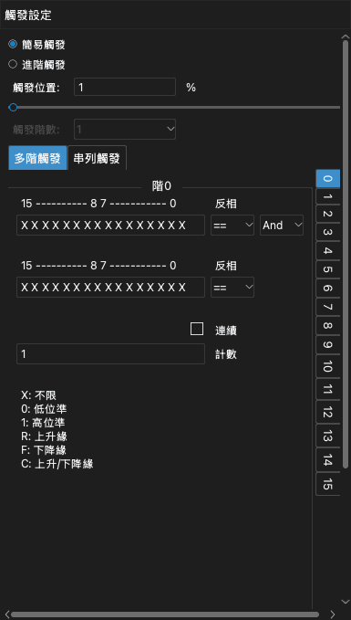
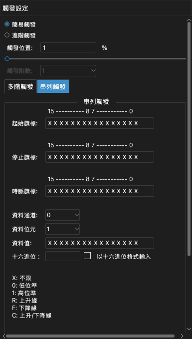

# 觸發

觸發是訊號中的一個條件。條件發生時，裝置把該時間標記為觸發點。觸發讓您擷取要檢查的那部分訊號。

應用程式有兩種觸發：

- **簡易觸發**：一個或多個通道上的邊緣或準位。
- **進階觸發**：一連串條件，或串列匯流排上的一個值。

要開啟觸發停駐面板，按一下工具列上的 **觸發** 或按 `T`。

> [!NOTE]
> 如果訊號不符合觸發條件，擷取會持續等待。要不使用觸發檢視訊號，按一下 **立即**。要停止等待，按一下 **停止**。

## 觸發位置

**觸發位置** 設定觸發點在擷取中的位置。該值是取樣時長的百分比。

- 較小的值（例如 10%）顯示更多觸發之後的訊號。
- 較大的值（例如 90%）顯示更多觸發之前的訊號。

觸發位置使用裝置的記憶體。因此，只能在緩衝模式下設定觸發位置。在串流模式下，觸發位置一律約為 1%。

<!-- TODO: new screenshot -->

## 簡易觸發

波形區中的每個通道標籤有五個觸發按鈕。從左到右，這些按鈕是：

1. 上升緣
2. 高準位
3. 下降緣
4. 低準位
5. 上升緣或下降緣

要設定簡易觸發，執行以下步驟：

1. 開啟觸發停駐面板。
2. 選取 **簡易觸發**。
3. 在通道的標籤上，按一下您需要的觸發按鈕。該按鈕以不同的顏色顯示。
4. 要移除通道上的觸發，再按一下同一個按鈕。
5. 設定 **觸發位置**。

如果在多個通道上設定觸發，所有條件必須在同一個取樣發生（邏輯 AND）。

## 進階觸發

> [!NOTE]
> 進階觸發只在緩衝模式下可用。要使用進階觸發，把 **操作模式** 設為 **緩衝模式**。請參閱[裝置選項](05-device-options.md)。

要使用進階觸發，在觸發停駐面板中選取 **進階觸發**。然後選取 **多階觸發** 分頁或 **串列觸發** 分頁。

### 每個通道的值

多階觸發和串列觸發使用一列 16 個字元。每個字元是一個通道的條件。最右邊的字元是通道 0。最左邊的字元是通道 15。

| 字元 | 條件 |
| --- | --- |
| `X` | 所有值（該通道沒有作用）。 |
| `0` | 低準位。 |
| `1` | 高準位。 |
| `R` | 上升緣。 |
| `F` | 下降緣。 |
| `C` | 上升緣或下降緣。 |

### 多階觸發

多階觸發是一連串條件。每個條件是一階。裝置首先檢查第 0 階。某一階的條件發生時，裝置進入下一階。最後一階完成時，觸發發生。最多可以使用 16 階。

每一階有以下設定：

- 兩列通道條件。
- 每一列的 `==` 或 `!=`。使用 `==` 時，通道與該列相符則條件發生。使用 `!=` 時，通道與該列不相符則條件發生。
- **且** 或 **或**。此設定連接兩列。
- **計數**：該階完成之前條件必須發生的次數。
- **連續**：勾選此核取方塊時，條件必須在連續的取樣中發生，不能中斷。

要設定多階觸發，執行以下步驟：

1. 在 **觸發階數** 中選取階數。
2. 在右側的階清單中，按一下第 0 階。
3. 在第一列中輸入通道條件。
4. 如有必要，在第二列中輸入通道條件，然後選取 **且** 或 **或**。
5. 在 **計數** 中輸入一個值。
6. 對其他每一階重複步驟 2 到 5。

以下是三個範例。

**範例 1。** 通道 0 保持高準位超過 1000 個取樣時觸發：

1. 把 **觸發階數** 設為 1。
2. 在第 0 階的第一列中，為通道 0 輸入 `1`。
3. 選取 **連續**。
4. 把 **計數** 設為 1000。

**範例 2。** 通道 0 上升緣或通道 1 下降緣時觸發：

1. 把 **觸發階數** 設為 1。
2. 在第 0 階的第一列中，為通道 0 輸入 `R`。
3. 在第二列中，為通道 1 輸入 `F`。
4. 選取 **或**。

**範例 3。** 通道 0 上升緣，然後通道 1 出現 100 個下降緣，然後通道 2 為高準位時觸發：

1. 把 **觸發階數** 設為 3。
2. 在第 0 階中，為通道 0 輸入 `R`。
3. 在第 1 階中，為通道 1 輸入 `F`。把 **計數** 設為 100。
4. 在第 2 階中，為通道 2 輸入 `1`。

### 串列觸發

串列觸發在串列匯流排上尋找一個資料值。它像移位暫存器一樣運作。設定如下：

- **起始旗標**：啟動串列觸發的條件。
- **停止旗標**：清除移位暫存器的條件。
- **時脈旗標**：向移位暫存器加入一個位元的條件。
- **資料通道**：傳送資料的通道。
- **資料位元**：值的位元數。
- **資料值**：引起觸發的值。

起始旗標發生後，裝置在每個時脈旗標處讀取資料通道。裝置把這個位元移入移位暫存器。移位暫存器的最後幾個位元等於 **資料值** 時，觸發發生。停止旗標發生時，裝置清除移位暫存器。

**範例 4。** I2C 匯流排上出現值 `010000100` 時觸發。通道 0 是 SCL，通道 1 是 SDA。

1. 把 **起始旗標** 設為 SCL 為高準位時 SDA 的下降緣：在最右邊的兩個字元中輸入 `F1`。
2. 把 **停止旗標** 設為 SCL 為高準位時 SDA 的上升緣：`R1`。
3. 把 **時脈旗標** 設為 SCL 的上升緣：為通道 0 輸入 `R`。
4. 把 **資料通道** 設為 1。
5. 把 **資料位元** 設為 9。
6. 在 **資料值** 中輸入 `010000100`。

**範例 5。** SPI 匯流排的 MOSI 上出現值 `0x1234` 時觸發。通道 0 是 CS#，通道 1 是 CLK，通道 2 是 MISO，通道 3 是 MOSI。

1. 把 **起始旗標** 設為 CS# 的下降緣：為通道 0 輸入 `F`。
2. 把 **停止旗標** 設為 CS# 的上升緣：為通道 0 輸入 `R`。
3. 把 **時脈旗標** 設為 CLK 的上升緣：為通道 1 輸入 `R`。
4. 把 **資料通道** 設為 3。
5. 把 **資料位元** 設為 16。
6. 在 **資料值** 中輸入 `0001001000110100`。

要以十六進位輸入值，選取 **以十六進位格式輸入**。然後在 **十六進位** 欄位中輸入該值。
