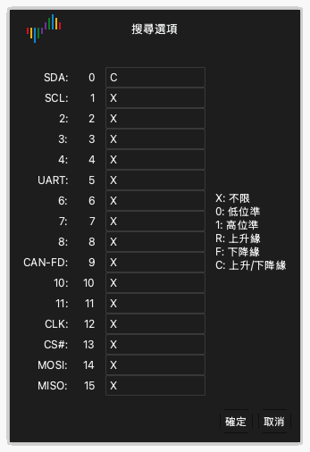

# 檢視波形

擷取之後，波形區把每個通道的資料顯示為波形。

## 向左或向右移動波形

使用以下方法之一：

- **拖曳。** 把指標放在波形上。按住滑鼠左鍵，向左或向右移動滑鼠。
- **快速拖曳。** 快速拖曳波形，然後放開滑鼠按鈕。波形繼續移動。然後波形移動變慢並停止。要開啟或關閉此功能，使用顯示選項中的 **以滑鼠拖曳捲動波形**。請參閱[安裝和啟動應用程式](02-install.md)。
- **捲軸。** 拖曳視窗底部的捲軸。
- **鍵盤。** 按 `Page Up` 或 `Page Down`。波形移動一個視窗寬度。

## 放大和縮小

使用以下方法之一：

- **滑鼠滾輪。** 把指標放在波形上，轉動滑鼠滾輪。指標保持在縮放的中心。
- **區域縮放。** 按住滑鼠右鍵，在波形上拖曳。放開按鈕。應用程式放大您選取的區域。
- **全部顯示。** 用滑鼠右鍵按兩下波形。應用程式顯示所有資料。再用滑鼠右鍵按兩下，返回上一個縮放。
- **鍵盤。** 按 `←` 放大。按 `→` 縮小。

## 尋找樣式

搜尋在通道上尋找準位和邊緣的樣式。

1. 按一下工具列上的 **搜尋** 或按 `R`。搜尋列在視窗底部開啟。
2. 按一下搜尋欄位。**搜尋選項** 視窗開啟。
3. 為每個通道輸入字元 `X`、`0`、`1`、`R`、`F` 或 `C` 之一。[觸發](07-trigger.md)說明每個字元的作用。
4. 按一下 **確定**。
5. 按一下搜尋列中的箭頭按鈕，前往上一個結果或下一個結果。

例如，為通道 0 輸入 `C`，為其他所有通道輸入 `X`。然後搜尋找到通道 0 上的每個邊緣。

## 變更通道

每個通道在波形區左側有一個標籤。標籤顯示通道的顏色、名稱和編號。

### 變更顏色

1. 按一下通道標籤上的顏色區域。
2. 選取一種顏色。
3. 按一下 **確定**。

### 變更名稱

1. 按一下通道標籤上的名稱。
2. 輸入新名稱。
3. 按 `Return`。

### 變更通道的順序

把指標放在通道標籤上時，指標顯示一個箭頭。使用以下方法之一移動通道：

- 在標籤上按住滑鼠左鍵，向上或向下拖曳通道。在新位置放開按鈕。
- 按一下標籤以選取通道。移動滑鼠。通道隨滑鼠移動。在新位置再按一下以釋放通道。
- 按住 `Command` 並按一下多個標籤。移動滑鼠。所選通道隨滑鼠移動。再按一下以釋放這些通道。
