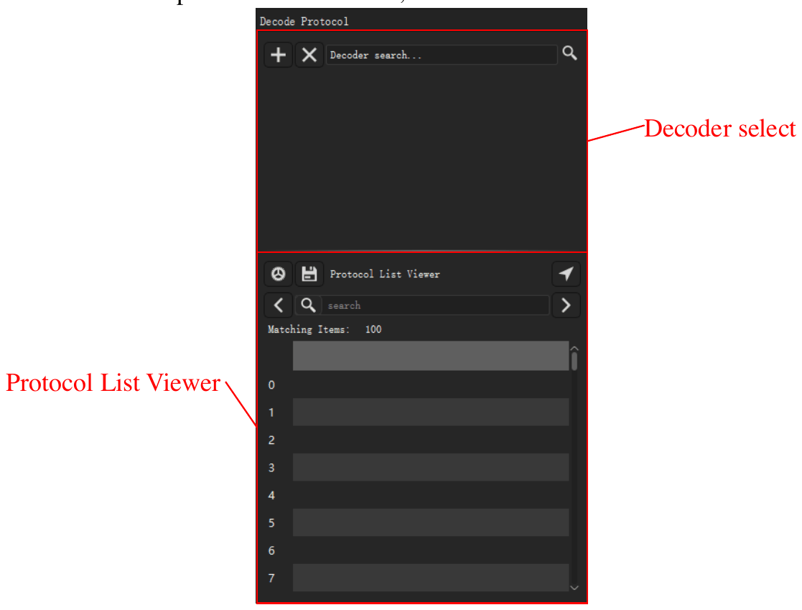

# 協定解碼器

協定解碼器讀取擷取的資料，並找出協定的訊框，例如 UART、I2C 或 SPI。應用程式把結果顯示為通道上方的新列。應用程式有 100 多個解碼器。

要開啟解碼器停駐面板，按一下工具列上的 **解碼** 或按 `D`。停駐面板有兩部分：

- 解碼器清單，頂部有 **搜尋解碼器...** 欄位。
- **解碼結果** 清單。此清單把解碼器的每一項顯示為一列文字。

<!-- TODO: new screenshot -->

## 新增解碼器

> [!NOTE]
> 帶有前綴 `0:` 的解碼器是精簡版本。它不顯示位元。您不能在它上面新增更高層的協定。它解碼更快，使用的記憶體更少。

1. 按一下 **搜尋解碼器...** 欄位。解碼器清單開啟。
2. 輸入協定名稱的一部分，例如 `I2C`。清單只顯示與該文字相符的解碼器。
3. 按一下解碼器。**解碼器選項** 視窗開啟。
4. 設定協定的通道。例如，為 I2C 設定 **SCL** 和 **SDA**。
5. 設定協定選項，例如 UART 的鮑率。
6. 選取應用程式顯示的結果列。
7. 如有必要，設定解碼區域。請參閱[解碼擷取的一部分](#decode-region)。
8. 按一下 **確定**。

應用程式解碼資料，並在波形區的新列中顯示結果。

要新增更多解碼器，對每個解碼器重複此程序。

要變更解碼器的設定，在停駐面板中按一下該解碼器的設定按鈕。

## 新增堆疊解碼器

一些協定使用更低層的協定。例如，24xx EEPROM 協定使用 I2C。新增更高層的協定時，應用程式也新增更低層的協定。

1. 在 **搜尋解碼器...** 欄位中，輸入更高層協定的名稱，例如 `24xx`。
2. 按一下解碼器。
3. 在 **解碼器選項** 視窗中，設定每個協定層的選項。
4. 按一下 **確定**。

結果顯示更低層協定的訊框，以及更高層協定的命令和資料。

## 解碼擷取的一部分 {#decode-region}

通常，應用程式解碼所有資料。要只解碼一部分，設定一個起始游標和一個結束游標。例如，您可以忽略電路重設時的雜訊。較短的區域也會減少解碼時間。

1. 在區域的起點和終點新增兩個游標。請參閱[量測](10-measure.md)。
2. 開啟該解碼器的 **解碼器選項** 視窗。
3. 在 **開始** 清單中，選取起始游標。
4. 在 **結束** 清單中，選取結束游標。
5. 按一下 **確定**。

## 閱讀結果清單

**解碼結果** 清單依時間順序顯示解碼器的各項。按一下一列，波形移到該項。

要變更清單顯示的欄，按一下清單頂部的設定按鈕。

## 在結果中尋找文字

1. 在 **解碼結果** 清單的搜尋欄位中輸入文字。
2. 按一下右箭頭，前往包含該文字的下一列。按一下左箭頭，前往上一列。

搜尋找到的每一列，波形都會移到該列的項目。如果先按一下一列，搜尋從該列開始。

要尋找一串位元組，在位元組之間加入符號 `-`。例如，`70-70-70` 尋找三個連續的值為 70 的位元組。

> [!NOTE]
> 位元組串搜尋只適用於 UART、I2C 和 SPI 解碼器。

## 匯出結果

1. 按一下 **解碼結果** 清單頂部的儲存按鈕。**協定匯出** 視窗開啟。
2. 在 **匯出格式** 中，選取 CSV 或 TXT。
3. 選取您要匯出的每一欄。應用程式依時間順序把所有欄放入一個檔案。
4. 按一下 **確定**。
5. 選取資料夾並輸入檔案名稱。
6. 按一下 **儲存**。

## 刪除解碼器

- 要刪除一個解碼器，按一下該解碼器所在列上的 **×** 按鈕。
- 要刪除所有解碼器，按一下停駐面板頂部 **+** 按鈕旁邊的 **×** 按鈕。
