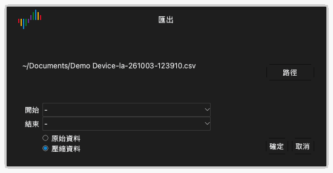

# 檔案和工作階段

按一下工具列上的 **檔案** 開啟檔案選單。選單有以下項目：

- **設定**：用於載入和儲存工作階段的選單。
- **開啟...**：開啟資料檔案。
- **儲存...**：儲存擷取的資料。
- **匯出...**：把資料匯出為其他格式。
- **螢幕截圖...**：儲存視窗的影像。

## 工作階段

工作階段檔案包含設定，但不包含擷取的資料。工作階段包括裝置選項、啟用的通道、通道的名稱和顏色以及觸發設定。工作階段檔案的副檔名為 `.dsc`。

### 儲存工作階段

1. 按一下 **檔案** › **設定** › **儲存工作階段**。
2. 選取資料夾並輸入檔案名稱。
3. 按一下 **儲存**。

### 載入工作階段

1. 按一下 **檔案** › **設定** › **載入工作階段**。
2. 選取工作階段檔案。
3. 按一下 **開啟**。

### 回復初始設定

按一下 **檔案** › **設定** › **載入預設工作階段**。應用程式把裝置的所有設定回復為初始值。

結束時，應用程式自動儲存設定。再次啟動時，應用程式載入上一次工作階段的設定。

## 儲存資料

1. 按一下 **檔案** › **儲存...**。
2. 選取資料夾並輸入檔案名稱。
3. 按一下 **儲存**。

應用程式把資料和設定儲存在副檔名為 `.dsl` 的檔案中。您可以在 Logic Analyze 中再次開啟此檔案。

> [!CAUTION]
> 應用程式不會自動儲存資料。開始新的擷取或結束應用程式之前，儲存資料。新的擷取會取代上一次擷取的資料。

## 開啟資料檔案

1. 按一下 **檔案** › **開啟...**。
2. 選取副檔名為 `.dsl` 的檔案。
3. 按一下 **開啟**。

應用程式在波形區中顯示資料。裝置類型標籤顯示 **檔案**。

## 匯出資料

匯出產生其他程式可以讀取的檔案。

1. 按一下 **檔案** › **匯出...**。**匯出** 視窗開啟。
2. 按一下 **路徑**。
3. 選取資料夾，輸入檔案名稱，然後選取格式。
4. 按一下 **儲存**。
5. 如果格式是 CSV，選取 **原始資料** 或 **壓縮資料**。壓縮資料只在值每次變化時包含一列。
6. 按一下 **確定**。

在邏輯分析儀模式下，可以使用以下格式：

| 格式 | 副檔名 | 用途 |
| --- | --- | --- |
| CSV | `.csv` | 試算表程式和指令碼。 |
| VCD | `.vcd` | 波形程式，例如 GTKWave。 |
| Gnuplot | `.gnuplot` | Gnuplot 程式。 |
| srzip | `.srzip` | sigrok 程式，例如 PulseView。 |

在示波器模式和資料擷取模式下，只能使用 CSV。

## 儲存視窗的影像

1. 按一下 **檔案** › **螢幕截圖...**。
2. 選取資料夾並輸入檔案名稱。
3. 選取 PNG 或 JPEG。
4. 按一下 **儲存**。
